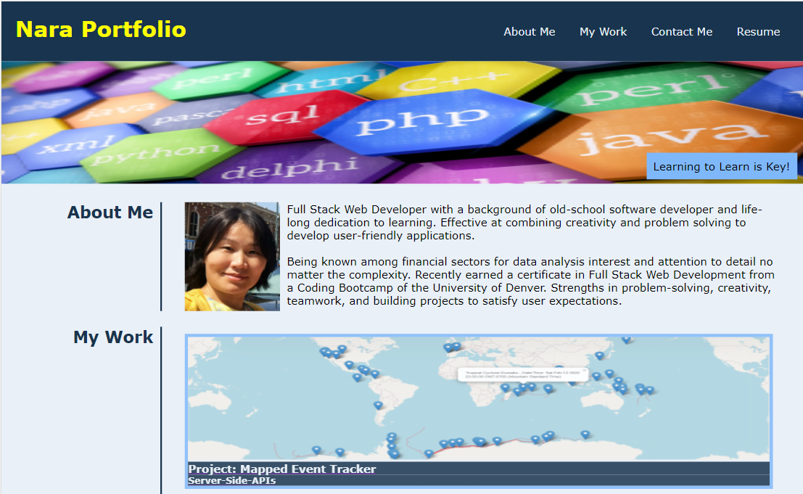

# Portfolio Homepage
Bootcamp week 2 : Homework

# 02 Advanced CSS: Portfolio

## Table of Contents
-[Description](#description)<br>
-[Task Requirements](#task-requirements)<br>
-[User Story](#user-story)<br>
-[Screenshot](#screenshot)<br>
-[Wireframes](#lofi-wires)<br>
-[Live](#live)

## Description

It is my Portfolio homepage. This portfolio represents with the developer's name, a recent photo or avatar, and links to sections "about me", "my work", and how to "contact me". Only uses CSS3 with a responsive layout that adapts to any viewport.

The UI scrolls to a section with titled images of the developed applications. When the link is clicked it will taken to that deployed application live website. 

## Task Requirements

Create a web application from scratch! This week, you'll build a portfolio page, which you can add to as the course progresses. 

A portfolio of work can showcase your skills and talents to employers looking to fill a part-time or full-time position. An effective portfolio highlights your strongest work as well as the thought processes behind it. Students who have portfolios with deployed web applications (meaning they are live on the web) are typically very successful in their career search after the boot camp. 

With these points in mind, in this homework you’ll set yourself up for future success by applying the core skills you've recently learned: flexbox, media queries, and CSS variables. You'll get to practice your new skills while creating something that you will use during your job search. It’s a win-win that you'll likely be grateful for in the future!

Here are the critical requirements necessary to develop a portfolio that satisfies a typical hiring manager’s needs:

GIVEN I need to sample a potential employee's previous work
WHEN I load their portfolio
THEN I am presented with the developer's name, a recent photo or avatar, and 
links to sections about them, their work, and how to contact them
WHEN I click one of the links in the navigation
THEN the UI scrolls to the corresponding section
WHEN I click on the link to the section about their work
THEN the UI scrolls to a section with titled images of the developer's applications
WHEN I am presented with the developer's first application
THEN that application's image should be larger in size than the others
WHEN I click on the images of the applications
THEN I am taken to that deployed application
WHEN I resize the page or view the site on various screens and devices
THEN I am presented with a responsive layout that adapts to my viewport.

## User Story

```
AS AN employer
I WANT to view a potential employee's deployed portfolio of work samples
SO THAT I can review samples of their work and assess whether they're a good candidate for an open position
```

## Screenshot

The following image shows the web application's appearance:


## LoFi Wires

The portfolio webpage's functionality scheme and links:
```
Nara Portfolio
│
│ --About Me (my profile photo and short introduction)
│
│ --My Work (my latest 5 project links)
│
│ --Resume (downloadable PDF file)
│
└───Contact Me
    │
    └─── Phone
    │
    └─── Email
    │
    └─── GitHub (https://github.com/Nara1469)
    │
    └─── LinkedIn (https://linkedin.com/in/naradavaasuren)
```

## Live
Can be found live at <a href= "https://nara1469.github.io/PortfolioHomepage/">Nara Portfolio</a>

